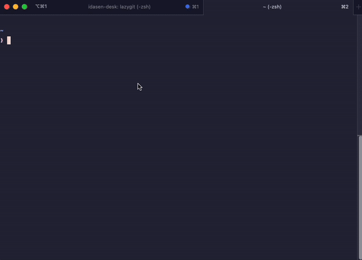
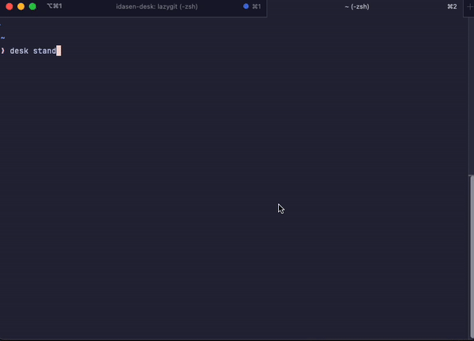
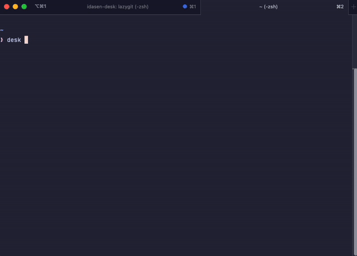
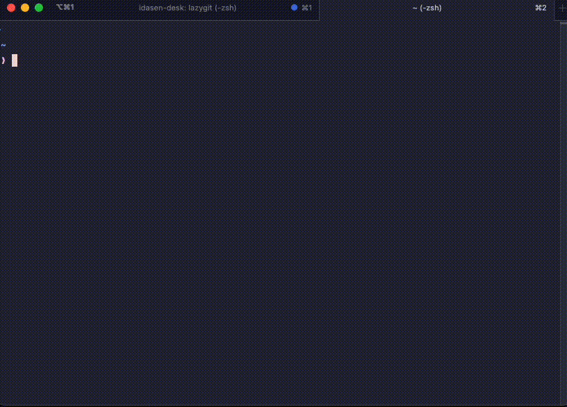

# IDÅSEN Desk - CLI


![License][license-badge]
![Go][go-version-badge]
![Version][release-version-badge]

## Why?

I own an IKEA IDÅSEN Desk, a standing desk equipped with Bluetooth functionality but lacking configurable buttons.
Unfortunately, the Bluetooth adapter only accommodates one connected device at a time. To overcome this limitation and
enable remote control from anywhere within or outside my house, I developed a command-line interface (CLI) tool. This
tool enables my Raspberry Pi to establish a connection with the desk and act as its controller. All my computers,
laptops, and phones are configured with SSH certificates, facilitating remote connections. Through SSH, these devices
can securely connect to the Raspberry Pi and control the desk.

### Operating System Compatibility

Although the Bluetooth library used supports Windows, Mac, and Linux, the CLI tool is specifically designed for Linux as
it was developed on a Raspberry Pi platform. Each operating system has its own underlying implementation, tailored to
the build target. Consequently, attempts to build the tool on platforms other than Linux may result in failure.

### Configuration File

The default values for the sitting and standing positions, along with the connection address for the desk, are stored
within a YAML file located on disk at the designated `--config` location. By default, this location is relative to the
binary execution location (`./.desk.yml`). To simplify configuration setup, you can utilize the `desk configure` command
to generate an initial configuration file with predefined defaults.

## Usage

```bash
NAME:
   Idasen CLI - A simple CLI to interface with the Idasen desk

USAGE:
   desk-cli [global options] command [command options] [arguments...]

COMMANDS:
   configure  configure the device to connect to.
   stand      Move the desk to the configured standing position.
   sit        Move the desk to the configured sitting position.
   position   Move the desk to the provided position value.
   toggle     Toggle the desk height between standing and sitting.
   monitor    Monitor and log the position of the desk as it moves
   help, h    Shows a list of commands or help for one command

GLOBAL OPTIONS:
   --help, -h  show help (default: false)
```

To see any additional configuration options for a given command you can run the 
following to see the output for a single command.

```bash
desk help $COMMAND
# desk help stand
```

### Configure

The configure command will display a list of bluetooth devices currently
connected to your adapter or broadcasting. Selecting the given device will
save the localised name and address to the configuration file for execution.


<p>
    
</p>

### Standing

Move the desk from the current position to the configured standing position.

<p>
    
</p>

### Sitting

Move the desk from the current position to the configured sitting position.

<p>
    
</p>

### Monitoring

Connect to the desk and monitor the height as it changes during manual operation.

<p>
    
</p>

[license-badge]: https://img.shields.io/github/license/stephensli/idasen-desk?style=flat-square

[go-version-badge]: https://img.shields.io/github/go-mod/go-version/stephensli/idasen-desk?style=flat-square

[release-version-badge]: https://img.shields.io/github/v/release/stephensli/idasen-desk?style=flat-square
